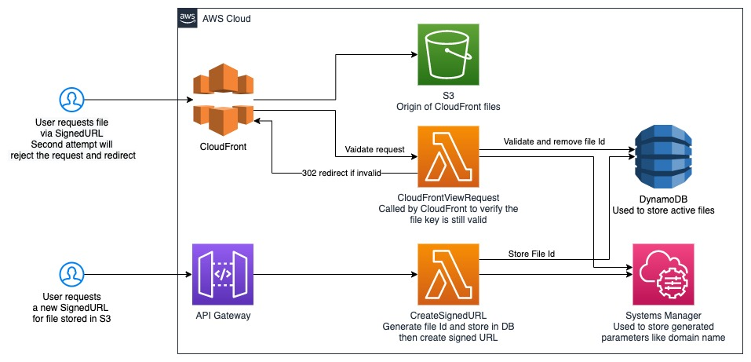
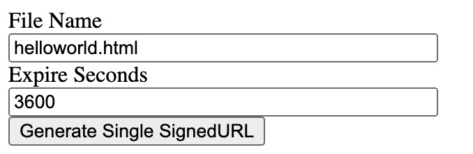
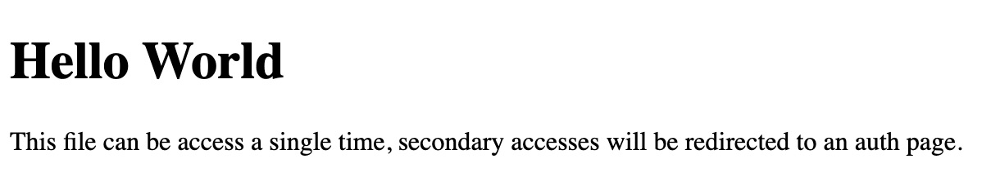
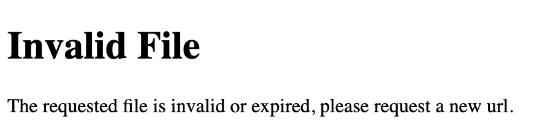

# Single Use SignedURL
AWS CDK to create a CloudFront distribution with a request Lambda to allow single use signed URL file downloads. Each file is tracked by an identifier which is stored in a DynamoDB database. 
Each request will check the identifier against values stored in the database. 
If the identifier is found the file process continues and the files is received, the id is then removed from the database.
If the identifier is not found the system will perform a 302 redirect to a specified URL.

### Architecture


### Requirements
* A CloudFront Key Pair
* The CloudFront Key Pair private key PEM file
* <a href="https://docs.aws.amazon.com/cdk/latest/guide/cli.html">AWS CDK Toolkit</a>

### Setup
1. Create a CloudFront Key Pair (**Root Account required**).
You can configure your CloudFront key pair through the <a href="https://console.aws.amazon.com/iam/home?region=us-east-1#security_credential">Security Credentials page in the IAM console</a>. 
Make sure you download your private key, and make a note of the key pair ID listed in the AWS Management Console.
1. Next we will store the private key file (PEM) in <a href="https://console.aws.amazon.com/secretsmanager/home?region=us-east-1#/listSecrets">Secrets Manager</a>.
    * First store a new secret 
    * Select "Other type of secrets"
    * Select "Plaintext"
    * Replace the entire contents of the edit box with the entire contents of the private key PEM file
    * Enter a secret name (SignedURLPem is used in this sample)
    * Save the secret
1. Edit the cdk.json file and update the following values:
    * keyPairId - The Id of the CloudFront Key Pair
    * secretName - The name of the secrets manager value that holds the PEM file used to sign URLs
1. From a terminal window at the root directory of this project do ```cdk synth```
1. From a terminal window at the root directory of this project do ```cdk deploy```
1. Once the deployment is complete the terminal window will display outputs of the deployment. One of the outputs will be ```CreateSignedURLEndpoint```, navigating to this endpoint will display a web page used to generate single use signed URLS.
    * Click the **Generate Single SignedURL** button on this page to generate a signed url with the given sample helloworld.html sample file.</br>
    * Click the **Open URL** button to display the file</br>
    * Once the file is displayed try refreshing to the page and notice **Invalid File** is now displayed.</br>

### Resource Cleanup
1. From a terminal window at the root directory of this project do ```cdk destroy```
    * The ```cdk destroy``` command will sometimes fail due to the ```CloudFrontViewRequest``` function currently being use by CloudFront. There can be a long wait period while the CloudFront resources are cleaned up.
    * If a failure occurs log into the AWS console and goto the CloudFormation console and manually delete the stack. It is recommended to check the option to retain the ```CloudFrontViewRequest``` function and manually remove it later.
1. Manually remove the two S3 buckets created which are given as outputs when you deploy.
    * The bucket names will begin with ```singleusesingedurl-```
